


<a href="https://linkedin.com/in/mhmtemnbgr"></a>&nbsp;
<a href="mailto:mhmtemnbgr00@gmail.com"></a>&nbsp;
<a href="https://github.com/mhmtemnbgr1?tab=repositories"></a>

 

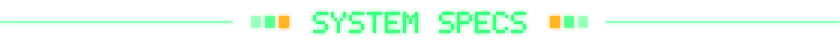


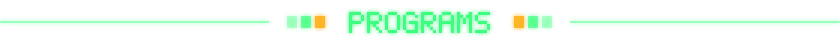

<a href="https://github.com/mhmtemnbgr1/ILDA"></a>
<a href="https://github.com/mhmtemnbgr1/ULAK"></a>
<a href="https://github.com/mhmtemnbgr1/vian"></a>
<a href="https://github.com/mhmtemnbgr1/url-shortener"></a>
<a href="https://github.com/mhmtemnbgr1/Kivi"></a>
<a href="https://github.com/mhmtemnbgr1/StickCity-Pomodoro"></a>
<a href="https://github.com/mhmtemnbgr1/GridSplit2D"></a>
<a href="https://github.com/mhmtemnbgr1/Video-to-Frame"></a>

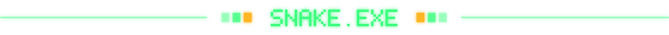

